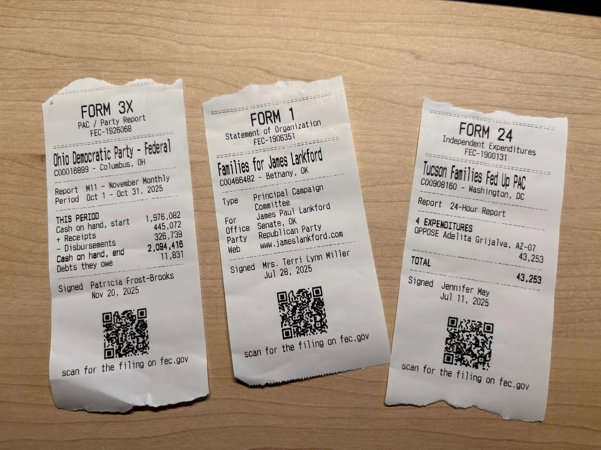

# fec-receipt-printer

Experimental program that prints [FEC filings](https://www.fec.gov/help-candidates-and-committees/filing-reports/fecfile-software/) on my receipt printer.




Currently built as a Rust CLI for now, but working to make it a Python/Node.js thing, and more extensible! Ie imagine a "print a receipt for every donation from Elon Musk", or "Print a receipt for every 24-hour notice from a congressional candidate in Texas".

```bash
cargo run -- preview 1926068            # 32-column preview in the terminal
cargo run -- preview FEC-1926068 --full # + detailed summary / every item / whole text
cargo run -- preview path/to/x.fec --html out.html
cargo run -- print 1926068              # to the printer over USB
cargo run -- print 1926068 -o x.bin     # dry run: write the ESC/POS bytes
cargo run -- serve                      # debug viewer on http://127.0.0.1:8058/
cargo run -- serve --host 0.0.0.0       # reachable from other machines (no auth!)
```

A filing can be an ID (`1926068`, `FEC-1926068`, fetched from docquery.fec.gov),
a URL, or a path to a `.fec` file. Only the header and cover are downloaded,
except for Form 24, which reads its Schedule E rows.

## Debug viewer

`serve` renders the receipt at true scale (1 CSS px = 1 printer dot, 12px per
character) as a paper strip. It has a 32-column grid toggle, the estimated
paper length, any layout warnings, the exact ESC/POS bytes as a hex dump and a
`.bin` download, and a Print button that turns on when the printer is plugged
in. The sidebar lists the cover fixtures in `fixtures/covers/`, one or two for every form.

## In the browser

```bash
make -C web serve    # builds the WASM bundle, then http://localhost:8000/
```

The same code compiled to WebAssembly (about 770KB gzipped). Drop a `.fec` file on
the page, open one, or pick a bundled sample (`#F3XN_1926068` links to one).
The page shows the same paper-strip preview, and **Connect printer…** / **Print**
send the receipt over WebUSB. That needs Chrome or Edge, on localhost or https.
On Linux the kernel's `usblp` driver claims the printer first, so it needs a udev
rule; on Windows it needs the WinUSB driver. Fetching by filing ID isn't
supported in the browser: docquery.fec.gov sends no CORS headers. `web/dist/` is
plain static files.
Every push to `main` deploys it to
[alexgarcia.xyz/fec-receipt-printer](https://alexgarcia.xyz/fec-receipt-printer/).

## How it fits together

```
source.rs   ID | URL | path → fec_parser::Filing
forms/      typed Cover → Receipt (f3x, f3, f3p, f24, f99; generic for the rest)
receipt.rs  Receipt: laid-out lines (≤32 cols, ASCII) and 384-dot rasters
escpos.rs   Receipt → ESC/POS bytes
preview.rs  Receipt → terminal text / HTML
usb.rs      bytes → printer (0416:5011, bulk OUT endpoint 0x03)
serve.rs    the debug viewer
wasm.rs     browser entry point: bytes → preview HTML + ESC/POS bytes
web/        the browser page (WebUSB printing)
```

Everything except `source::open`, `usb.rs` and `serve.rs` is portable and builds
for `wasm32-unknown-unknown` on stable Rust.

All wrapping, padding and fitting happens in `receipt.rs`, once. The encoder and
the previews draw exactly what's there, so the viewer shows what the paper gets.

## Printer notes

- Raw USB only, no CUPS. Endpoint **0x03**; 0x01 silently prints nothing.
- The native QR command prints garbage. QR codes go out as `GS v 0` raster
  images; column-mode images (`ESC *`) shear.
- 384 dots = 32 characters in the 12x24 font.
- Tear-off only, no cutter: receipts end with a few blank lines, not a cut.

## Tests

```bash
cargo test                 # snapshot every fixture (default + --full), check widths
cargo test -- --ignored    # same width check over every filing in ~/.cache/libfec/cache
```

`fec-parser` comes from libfec's [`typed-covers`](https://github.com/asg017/libfec/tree/typed-covers)
branch (the stacked PRs asg017/libfec#30–#38), pinned in `Cargo.lock`. The cover
fixtures in `fixtures/covers/` are copied from that branch's
`crates/fec-parser/tests/fixtures/covers`.
